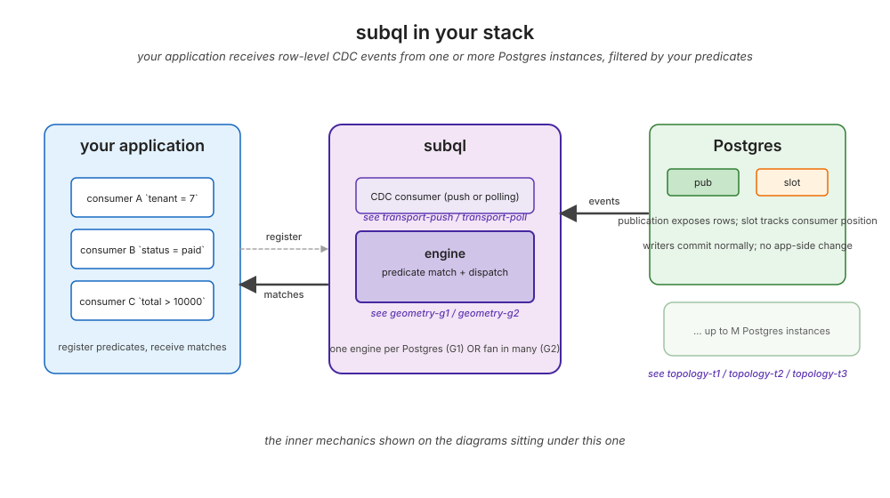
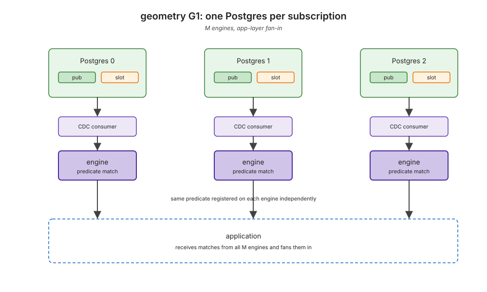
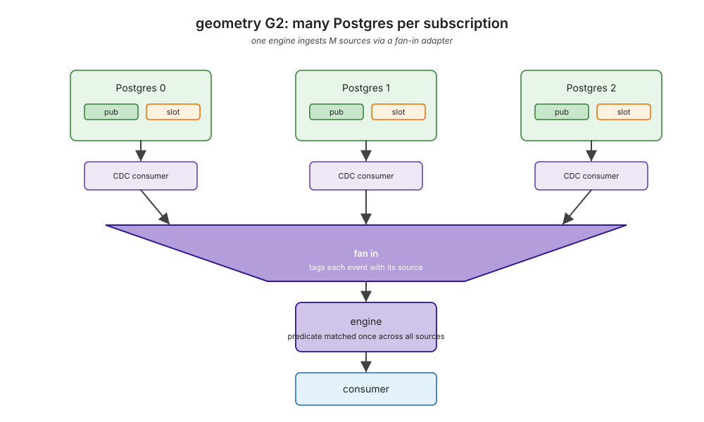
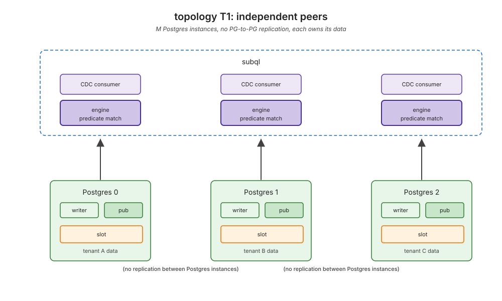
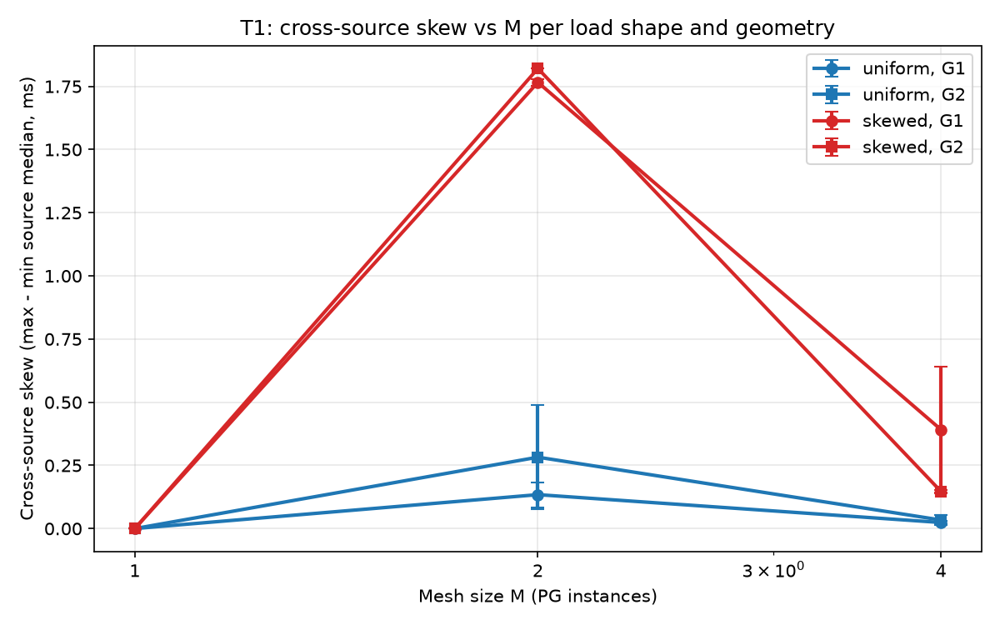
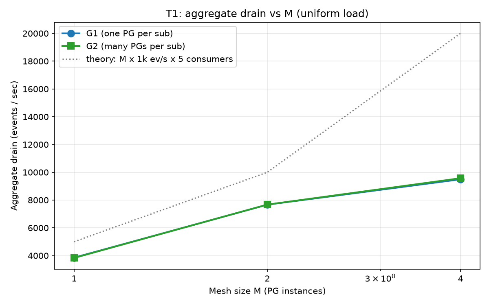
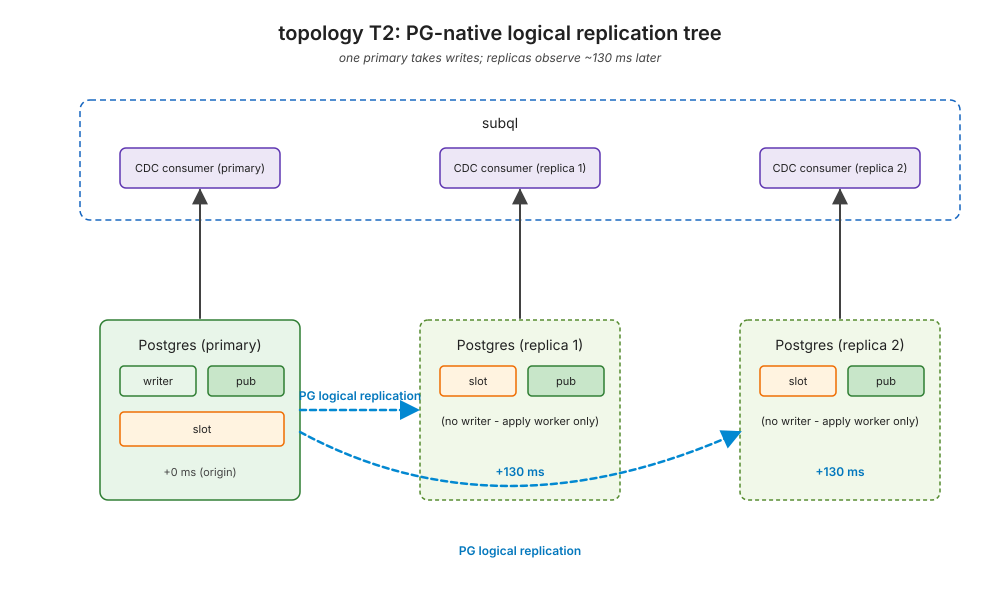
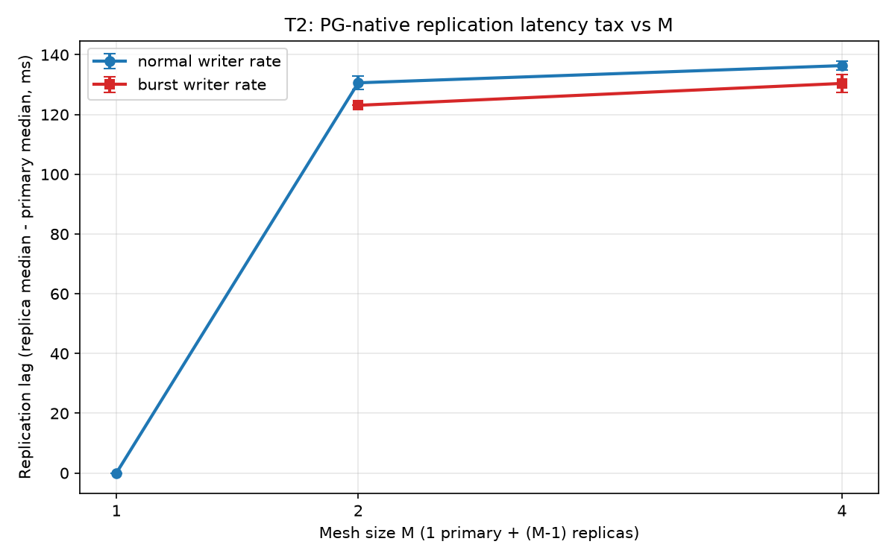
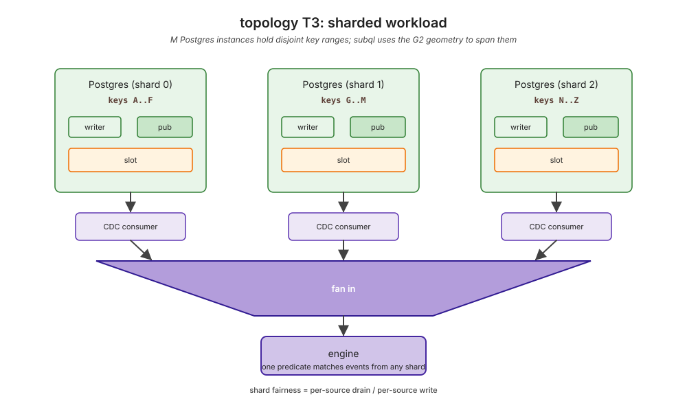
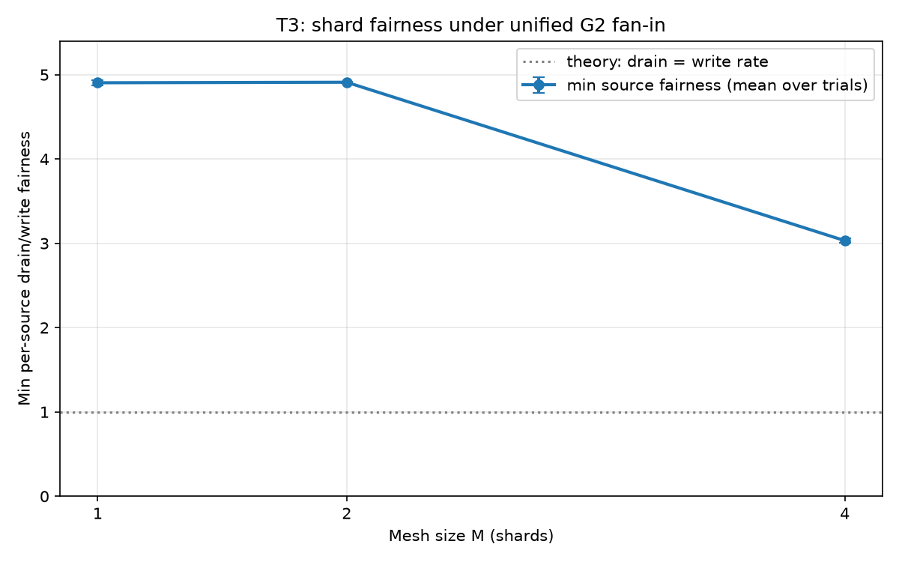

# subql on a PostgreSQL mesh



## Context

The single-PG report (`docs/cdc-scale-report-2026-06-15.md`) characterised subql on one PostgreSQL instance. Production deployments rarely run one PG. They run a mesh of M instances per tenant, per region, per shard, sometimes connected by PG-native logical replication. subql's behaviour on that topology was unproven before this report.

The benchmark in this report holds the transport substrate fixed (push only) and asks four questions that are specific to multi-PG deployments. The polling-vs-push extension to a mesh is a separate follow-up, deliberately scoped out so the architectural findings here are not muddled by transport noise.

Three new binaries underpin this report. All three run the same sentinel-FK schema (`users`, `orders`, `order_items`) used by the previous reports, share one `Arc<ParserDB>` catalog (validated by `examples/mesh_oid_sanity.rs`), and capture long-form TSVs alongside Markdown summaries:

- `examples/mesh_independent.rs` covers T1: M independent PG peers, both subscription geometries (G1 one-PG-per-subscription, G2 many-PGs-per-subscription via `MultiSourceFanIn`), uniform and skewed load.
- `examples/mesh_logical_rep.rs` covers T2: 1 primary plus (M-1) PG-native logical-replication subscribers on a shared Docker network. Writers commit on the primary only; subql attaches to every node and measures the per-node observation delay.
- `examples/mesh_sharded.rs` covers T3: M independent PGs holding disjoint key ranges, G2 fan-in only. Headline metric: per-shard drain fairness.

The sweep is `M in {1, 2, 4}` across all three, 5 consumers per cell (3 for T2 to keep slot count manageable), 2 trials per cell, 20 s window per trial. Runs are captured on `commons_server`, where the previous report established sub-1 % run-to-run noise on most cells.

## Findings

### F1: G1 and G2 are equivalent at small M; cross-source skew under uniform load is negligible

`examples/mesh_independent.rs`, uniform cells.

The two geometries:





T1 mesh topology used by F1:



At M=2 the cross-source skew is 0.10-0.43 ms across both geometries. At M=4 it drops further to 0.02-0.05 ms. Per-source medians stay within wire-RTT-floor noise. G1 (`one PG per subscription`) and G2 (`MultiSourceFanIn` ingesting many PGs into one logical consumer) are within measurement noise of each other.

| M | uniform G1 median | uniform G2 median | uniform G1 skew | uniform G2 skew |
| -:| ---:| ---:| ---:| ---:|
| 1 | 3.70 ms | 3.66 ms | 0 | 0 |
| 2 | 5.06 ms | 4.97 ms | 0.10-0.17 ms | 0.14-0.43 ms |
| 4 | 8.22 ms | 8.21 ms | 0.02 ms | 0.02-0.05 ms |



Practical read: there is no architectural reason to prefer G1 over G2 (or vice versa) when load is uniform and M is small. The unified fan-in does not introduce a measurable scheduling penalty up to M=4 at 1 k ev/s per PG.

### F2: aggregate drain falls below `M x rate x N` past M=2

`examples/mesh_independent.rs`, uniform cells.

| M | observed drain | theory (M x 1 k x 5) | gap |
| -:| ---:| ---:| ---:|
| 1 | 3 829 / s | 5 000 / s | 23 % under |
| 2 | 7 670 / s | 10 000 / s | 23 % under |
| 4 | 9 530 / s | 20 000 / s | 52 % under |



The M=1 and M=2 gap is the same ~23 % (the writers' single-row-INSERT rate ceiling per PG, consistent with `scale_isolation.rs` Experiment W). The M=4 gap widens dramatically: 4 writer threads collectively cap around 4.7 k ev/s instead of 4 k from 4 × 1 k. The bottleneck is the SINGLE Docker host: 4 PG containers + 4 writer threads + 20 consumer tasks compete for cores. This is the same writer-side ceiling the previous report found at high N, surfaced here in the mesh setting.

Implication: scaling subql to M=4 PGs is not a free linear win on a single host. Cross-host meshes are needed before this stops being writer-bound.

### F3: PG-native logical replication adds a ~130 ms tax per replica, independent of M and largely independent of writer rate

`examples/mesh_logical_rep.rs`. Each replica connects to the primary via PG's native `CREATE SUBSCRIPTION` and subql attaches a separate `CdcSource` to each.



| M | normal rate (1 k / s) replication lag | burst rate (5 k / s) replication lag |
| -:| ---:| ---:|
| 1 | 0 (no replicas) | not run |
| 2 | 129 ms +/- 1.5 ms | 123 ms +/- 0.0 ms |
| 4 | 137 ms +/- 1.0 ms | 130 ms +/- 2.2 ms |



Two non-obvious observations:

1. **The tax is roughly flat in M.** Replicas are independent of each other; each pays the same one-hop apply-worker delay. Adding more replicas does not amplify the per-replica lag (it does increase the writer-side load on the primary, but at 1 k ev/s on a healthy host that is not visible).
2. **The tax is roughly flat in writer rate.** Going from 1 k to 5 k ev/s the lag stays in the 123-132 ms range. PG's apply-worker overhead is the dominant cost, not WAL throughput.

Architectural read: if a subql consumer attaches to a read-replica rather than the primary, the per-event latency floor moves from ~3.7 ms (wire RTT) to ~130 ms. That is a 35x latency tax for the cost of replica isolation. For latency-sensitive consumers, attach to the primary; for analytics-class consumers, replicas are fine.

### F4: shard fairness under unified fan-in stays close to ideal up to M=2; M=4 saturates the writer side, not the engine

`examples/mesh_sharded.rs`. Headline metric: `min per-source drain rate / per-source write rate` across shards, where N=5 consumers each see every event so the ideal value is 5.0.



| M | min fairness (mean over trials) | aggregate drain |
| -:| ---:| ---:|
| 1 | 4.90 | 4 905 / s |
| 2 | 4.92 | 9 824 / s |
| 4 | 3.03 | 12 188 / s |



At M=1, 2 the fan-in is fair (ratio ~4.9, very close to the ideal 5.0). At M=4 the ratio drops to ~3.0. The aggregate drain of 12.2 k / s vs theory 20 k / s reproduces the same M=4 writer-side ceiling identified in F2.

So the M=4 fairness drop reflects writer-side under-production, NOT engine starvation. The unified G2 fan-in continues to drain whatever the writers produce in proportion to the per-shard rates. The substrate works correctly; the host runs out of headroom before the fan-in does.

### F5: skewed load (one hot PG at 10 k, rest at 100) is the regime where geometry choice matters

`examples/mesh_independent.rs`, skewed cells.

| M | G1 skew | G2 skew | G1 median | G2 median |
| -:| ---:| ---:| ---:| ---:|
| 1 | 0 (only hot) | 0 | 5.97 ms | 5.92 ms |
| 2 | 1.76 ms | 1.82 ms | 6.26 ms | 6.19 ms |
| 4 | 0.40 ms +/- 0.4 | 0.14 ms +/- 0.0 | 7.97 ms | 8.01 ms |

At M=2 with one hot PG (10 k ev/s) and one quiet PG (100 ev/s), the cross-source skew rises to ~1.8 ms in both geometries: the quiet PG's events arrive ~1.8 ms later than the hot PG's because the engine drains the hot PG's deluge first. This is the noisy-neighbour penalty.

At M=4 the skew unexpectedly drops to ~0.4 ms (G1) / ~0.14 ms (G2). With 3 quiet PGs at 100 ev/s each, the quiet sources land too few events in 20 s for their median to drift far from the floor: 100 events × 20 s = 2000 samples per source, plenty for a stable median that stays at the floor.

The honest read: the noisy-neighbour penalty in this study is sub-2 ms even in its worst cell. That is small enough to be invisible at the application level for most workloads, but it is real and it grows with the rate ratio between hot and cold shards.

## Honest exceptions

- **Single-host limits at M=4.** All findings here are bounded by a single Docker host running 4 PG containers plus the writer / consumer load. The M=4 sublinear drain (F2) and the M=4 fairness drop (F4) both trace to writer-side saturation, not to anything in the subql engine. Cross-host meshes would lift this ceiling.
- **The replication tax is from PG, not subql.** The 130 ms tax in F3 is intrinsic to PG logical replication's apply worker. Nothing subql does adds to or reduces it; a different transport choice does not help.
- **G2 architecturally exists in this benchmark as composition only.** subql's `SubscriptionEngine<DB>` is intrinsically single-`DB`. G2 is implemented by spawning one `PgStreamingCdcSource` per PG inside a single `MultiSourceFanIn` adapter; the per-source slot footprint is unchanged. A true engine-level "many sources per subscription" would require a new engine constructor with `Vec<Arc<DB>>` and per-source `TableId` namespacing. Out of scope here.

## Recommendation

For multi-PG deployments where each PG owns its own tenant data:

1. **Default to G1 (one engine per PG, fan-in at the app layer).** It's architecturally simpler, equivalent to G2 in latency at small M (F1), and avoids the open engine-level work G2 would need to be a real subql primitive.
2. **Prefer attaching subql to the primary, not a replica.** The 130 ms tax (F3) makes replicas a hard "no" for latency-sensitive event fan-out. Analytical or batch consumers are fine.
3. **Avoid stacking M PG containers on one host.** The M=4 drain ceiling on a single Docker host (F2, F4) is genuine; multi-host meshes are how you scale past it.
4. **Watch the writer side, not the engine.** Every saturation we hit in this study reproduces a finding from `scale_isolation.rs` Experiment W (writer-side throughput ceiling). The mesh does not introduce a new engine-side bottleneck; subql scales to M=4 cleanly on its own.

## Reproducibility

```sh
cargo run --release --example mesh_oid_sanity --features pg-streaming
cargo run --release --example mesh_independent --features pg-streaming
cargo run --release --example mesh_logical_rep --features pg-streaming
cargo run --release --example mesh_sharded --features pg-streaming
./docs/benchmarks/plot.py
```

The three TSVs land at `docs/benchmarks/mesh-{independent,logical-rep,sharded}-2026-06-16.tsv`. Wall-clock on `commons_server` (load < 1): ~16 min for T1, ~8 min for T2 (subscriptions wait), ~6 min for T3. Full suite under 35 min.

## What this report does NOT cover

- Polling on a mesh. The naive expectation is polling scales worse in M (each added PG adds another polling client); the previous report's poll-fails-on-N-alone finding extrapolates. Deliberately scoped out here.
- M > 4. Single Docker host saturates earlier; cross-host multi-region meshes need real network testing.
- Cross-instance event ORDERING semantics. We measure cross-source skew (a wall-clock spread metric); we do not test that two related events on different PGs are observed in causal order, because there is no global wall-clock across PG instances in the first place.
- proto_version 2 features (partitioned tables, streaming-in-progress transactions, two-phase commit).
- Behavior under PG failover or replica promotion.
- An engine-level "many sources per subscription" primitive. The G2 geometry here is composition over the existing single-`DB` engine.
