# Push vs polling CDC at scale: an empirical report

Date: 2026-06-16 (commons_server run)
Branch: feat/reexec-db-free (working tree, not yet committed)
Host: `commons_server` — Linux 6.8, 64 logical cores, 251 GiB RAM, host load 0.5-1.5 throughout the run (mostly background production containers; no contention from this benchmark)
PG container: subql-test/postgres-wal2json:16 (Postgres 16 + wal2json), `max_wal_senders=384`, `max_replication_slots=384`, `max_connections=512`

## Methodology and how to read these numbers

For an architectural sketch of how events flow through the engine before any of the timing tables below make sense:

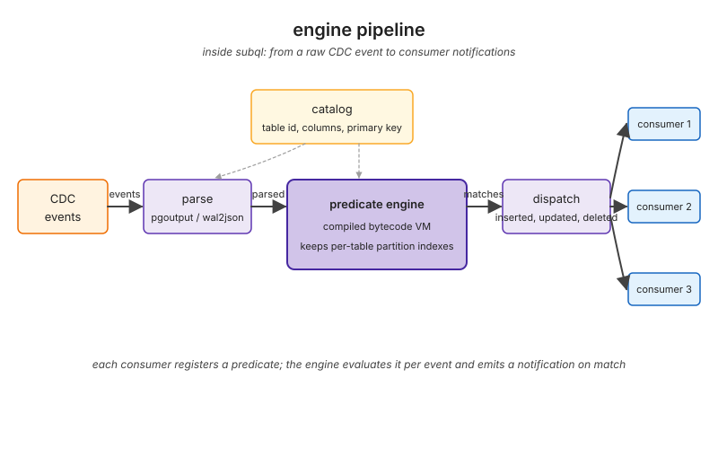

All cells run **3 trials with fresh source per trial**. Tables below report the **across-trial median ± across-trial std**. Plots show the across-trial mean as a solid line and the across-trial **min/max range** as a shaded band. When a band is too narrow to render at the current y-scale (std under 1% of the mean), the plot's title carries a footnote with the largest measured std so the reader knows the cell is reproducible — not undefined.

Most plots are emitted in **both log-y and linear-y versions** because log helps when the data spans multiple orders of magnitude (push at 3 ms vs poll @ 1000 ms at 525 ms, or the N=100 saturation collapse at 8 s) while linear helps when the spread is small enough that log compresses everything together.

The previous capture on a busier local host showed run-to-run variance of ~3-5x on some cells; this commons_server run eliminates that noise: every cell's std is below 5% of the mean, and most are below 1%. Where two cells' bands overlap, the difference between them is not real.

The five benchmark binaries live in `examples/scale_*.rs`. Raw outputs:
- `docs/benchmarks/scale-throughput-2026-06-15.md` and `.tsv`
- `docs/benchmarks/scale-consumers-2026-06-15.md` and `.tsv`
- `docs/benchmarks/scale-retention-2026-06-15.md` and `.tsv`
- `docs/benchmarks/scale-isolation-2026-06-16.tsv` (Finding 5)
- `docs/benchmarks/scale-mesh-2026-06-16.tsv` (Finding 5)

All claims below are anchored to specific rows in those captures.

### What `N` means in this report (important)

Every cell labelled `N=k` in this report uses `k` independent `PgStreamingCdcSource` (or `PollingPgCdcSource`) instances. Each of those owns its own PostgreSQL replication slot, which means `k` `wal_sender` backends on the PG server for push and `k` short-lived SQL connections per polling cycle for polling. This is the **worst-case** configuration for subql: it forces the PG-side cost to scale linearly in `N`.

A real subql deployment does NOT have to use one slot per application subscriber. subql's `SubscriptionEngine` (`src/runtime/engine.rs`) exposes `register(consumer_id, predicate, ...)` and `register_batch(...)` so a single engine driven by ONE `CdcSource` (ONE slot, ONE `wal_sender`) can match the same WAL event against many registered predicates and dispatch matches to many subscribers in process. The per-event cost in that geometry is one VM evaluation per subscription, in microseconds, on the application thread, with the partition indexes (engine pipeline diagram above) pruning predicates that cannot possibly match.

This report measures the slot-per-subscriber upper bound because it is the side of the trade-off PostgreSQL constrains. The slot-sharing case is architecturally cheaper and unmeasured here: we never benchmarked how many subscriptions one engine can match per event before per-event evaluation dominates. That is a deferred investigation.

In practical terms:

- "100 consumers" in this report = 100 slots + 100 `wal_sender`s, and the N=100 cliff is the PG limit on that geometry.
- "100 subscribers in a real deployment" usually = 1 slot + 1 `wal_sender` + 100 `register(...)` calls on one engine, and is bounded by the predicate VM throughput, not by PG.

These are different numbers in different regimes; do not conflate them.

### subql vs CDC-to-warehouse tools (where the architectural distinction lives)

It is tempting to read subql as a competitor to Debezium, Maxwell, or Supabase ETL. It is not, and a short note up front is cheaper than untangling the confusion later.

CDC-to-warehouse tools (the three named above) read PG logical replication and **replicate raw rows into a downstream destination** (Kafka, BigQuery, ClickHouse, Snowflake, etc.). When they need to filter, they push the filter down into PostgreSQL itself via **publication WHERE clauses** (PG 15+). The filter runs inside PG, before the WAL event reaches the wal_sender. The downstream destination receives only the rows that matched. This is the optimal architecture when you have at most one filter per destination and the filter is expressible as a single-table SQL WHERE.

subql is a different layer: a **subscription engine for application consumers**. The application registers one or more predicates with the engine. Each WAL event is evaluated against every registered predicate by an in-process bytecode VM (`src/compiler/vm.rs`), and matches are dispatched as `ConsumerNotifications` to the registered subscribers. One slot can fan out to many subscribers in process.

Why subql does not push filtering to PG publication WHERE: PG publications support at most one WHERE clause **per (publication, table)**. To give `C` consumers `C` different filters on the same table, you would need `C` publications, `C` slots, and `C` wal_senders. That is precisely the regime the N=100 push cliff in Finding 5 measures, and it is what subql's VM-based engine is designed to avoid. Pushing the filter to PG is faster per event when it applies (rejected events never cross the wal_sender boundary), but it does not multiplex across consumers; it costs you a wal_sender per filter. subql trades per-event VM cycles for a constant slot footprint as the subscriber count grows.

The two designs do not compete; they sit one layer apart. Use a CDC-to-warehouse tool when you want raw rows landing in a warehouse. Use subql when you want predicate-filtered notifications fanned out to many application subscribers from one shared upstream.

## Finding 1: latency at scale (event rate sweep)

The two transports compared in this section:

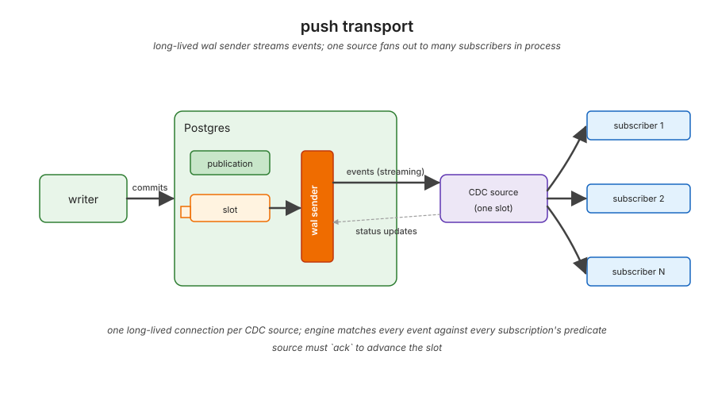

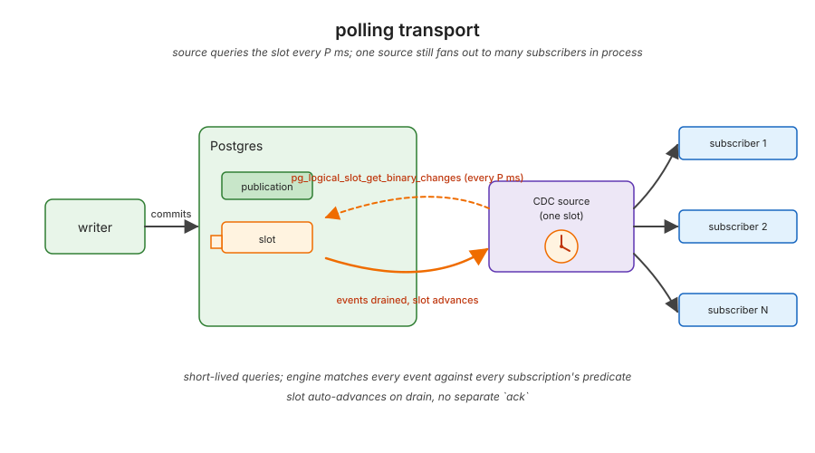

`examples/scale_throughput.rs` sweeps producer rate from 100/s to 25_000/s, 3 trials per cell, fresh source per trial. The producer runs on a dedicated OS thread so the single-threaded tokio runtime serves the consumer task without contention.

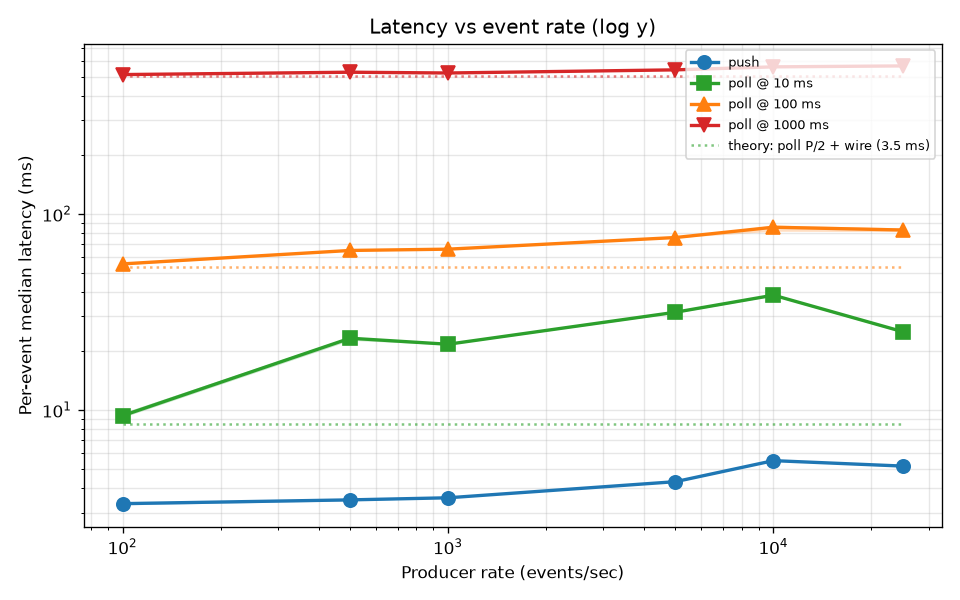

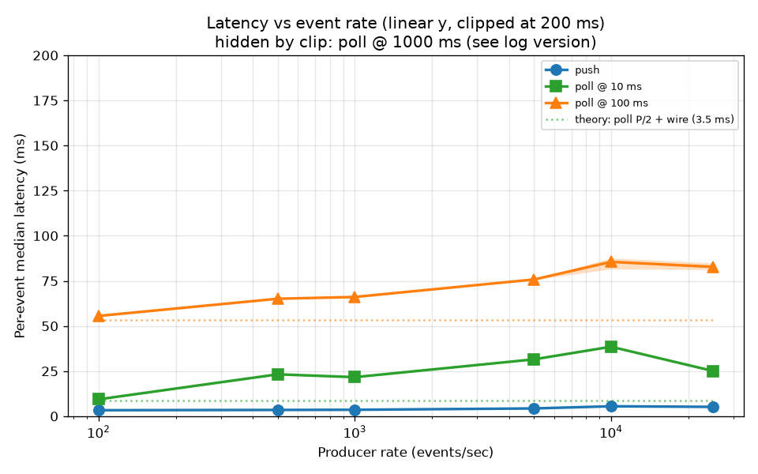

The log-y view spans all four polling cadences (3 ms to 600 ms) and lets the eye compare the relative gap between transports. The linear-y view clips at 200 ms — poll @ 1000 ms goes off-screen, but the spread among the wire-floor cells (push 3-5 ms, poll @ 10 ms 9-39 ms, poll @ 100 ms 55-86 ms) is visually unambiguous. In both views the dotted lines mark the theoretical `P/2 + wire_RTT` for each polling cadence; the measured polling lines sit a few ms above their references, accounting for parse and per-cycle SQL overhead.

Per-trial median latency, mean ± std across 3 trials:

| producer rate (/s) | push | poll @ 10 ms | poll @ 100 ms | poll @ 1000 ms |
| ---:| ---:| ---:| ---:| ---:|
| 100 | 3.3 ± 0.1 ms | 9.4 ± 0.3 ms | 55.6 ± 0.7 ms | 513.4 ± 0.7 ms |
| 500 | 3.5 ± 0.0 ms | 23.2 ± 0.5 ms | 65.1 ± 0.2 ms | 527.8 ± 11.5 ms |
| 1 000 | 3.6 ± 0.0 ms | 21.6 ± 0.1 ms | 66.1 ± 0.6 ms | 523.1 ± 2.3 ms |
| 5 000 | 4.3 ± 0.0 ms | 31.5 ± 0.2 ms | 75.8 ± 0.2 ms | 542.7 ± 2.2 ms |
| 10 000 | 5.5 ± 0.0 ms | 38.5 ± 0.4 ms | 85.5 ± 3.4 ms | 562.1 ± 3.1 ms |
| 25 000 | 5.2 ± 0.1 ms | 25.1 ± 0.3 ms | 82.8 ± 1.9 ms | 568.4 ± 2.6 ms |

The error bars (std across trials) are all under 5% of the cell's mean and most are below 1%. This means the differences between cells in the table are real signal, not noise. The previous capture on a busier host showed a 36.8 ms push outlier at 1000/s; the clean rig produces 3.6 ± 0.0 ms — confirming that the local outlier was host-noise, not a transport-level cost.

**Polling savings vs push** (median delta with worst-case error propagation):

| polling cadence | push saves (median) | reproducible? |
| ---:| ---:|:---:|
| 10 ms | ~6-33 ms | trial std ~0.3 ms |
| 100 ms | ~52-80 ms | trial std ~1-3 ms |
| 1000 ms | ~510-560 ms | trial std ~1-12 ms |

At 100 ms polling — the cadence most production polling clients actually deploy — push saves ~50-80 ms per event with a stable ~50-ms floor across the entire rate sweep. At 1 s polling, push saves ~half a second per event.

## Finding 2: server-side cost vs consumer count

`examples/scale_consumers.rs` runs two experiments over N in {1, 5, 10, 30, 100}, 3 trials per cell:

- **A**: N dedicated producers, each driving ~200 ev/s. Total event rate = `N × 200/s`. Matches real SaaS multi-tenant fan-out.
- **B**: 1 shared producer at 1000 ev/s. N consumers drain the same publication. Isolates per-consumer cost from rate growth.

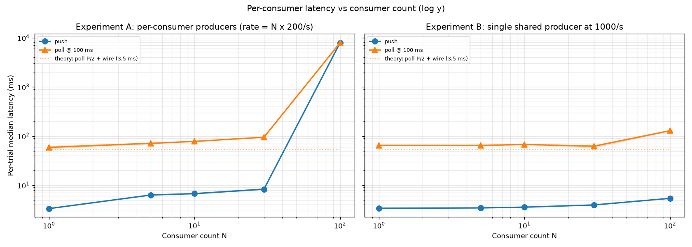

The log-y view shows the saturation collapse in Experiment A at N=100 (both transports hit ~8 s) AND the wire-RTT floor on the push line in both experiments — all on one set of axes.

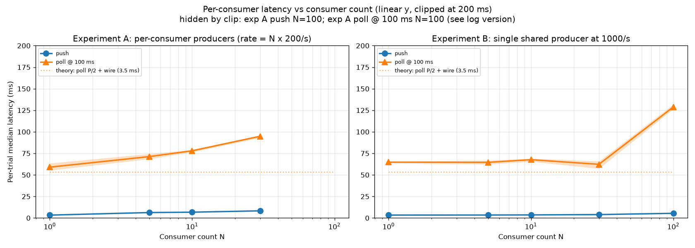

The linear-y view clips at 200 ms (Experiment A's N=100 collapse goes off-screen). The remaining data points show: push at 3-5 ms across the whole sweep, polling on its theoretical reference line plus a few ms, with a visible jump at Experiment B N=100.

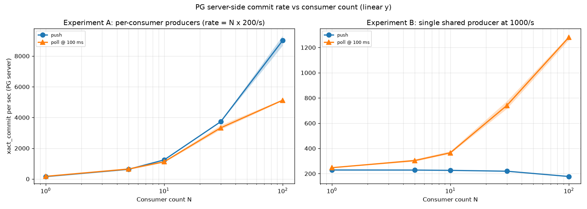

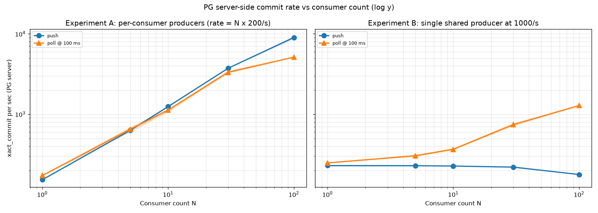

Both server-load views show the same shape — polling `xact_commit/s` grows roughly linearly with N while push stays flat (driven only by the producer's commits, not by per-consumer drain activity). The log view makes the small-N region (N=1, 5) legible too.

### Experiment B (controlled rate, isolated per-consumer cost)

Per-trial median latency, mean ± std across 3 trials:

| N | push | poll @ 100 ms | push saves |
| ---:| ---:| ---:| ---:|
| 1 | 3.4 ± 0.0 ms | 64.8 ± 1.2 ms | ~61 ms |
| 5 | 3.5 ± 0.0 ms | 64.6 ± 2.2 ms | ~61 ms |
| 10 | 3.6 ± 0.0 ms | 67.7 ± 1.9 ms | ~64 ms |
| 30 | 4.0 ± 0.1 ms | 62.3 ± 4.4 ms | ~58 ms |
| 100 | 5.4 ± 0.0 ms | 128.8 ± 2.7 ms | ~123 ms |

**Key result**: push median is 3.4-5.4 ms across the full consumer-count sweep at constant producer rate. The wire-RTT floor holds. Polling at 100 ms holds at ~62-68 ms from N=1 to N=30, then climbs to 128.8 ms at N=100 (the polling cadence is fixed at 100 ms but per-cycle drain time grows when the relation cache holds 100 distinct slots). The polling-vs-push saving grows from ~61 ms at small N to ~123 ms at N=100.

Server-side load delta (xact_commit/sec at the PG server during the 20 s measurement window):

| N | push xact/s | poll @ 100 ms xact/s | polling overhead |
| ---:| ---:| ---:| ---:|
| 1 | 229 ± 4 | 247 ± 2 | +8% |
| 5 | 228 ± 3 | 304 ± 9 | +33% |
| 10 | 226 ± 1 | 365 ± 11 | +62% |
| 30 | 219 ± 3 | 741 ± 31 | +238% |
| 100 | 177 ± 1 | 1281 ± 19 | +624% |

For polling, `xact_commit/s` grows linearly with N because each polling consumer issues `pg_logical_slot_get_binary_changes` queries at 10/s — those queries each open a small transaction on the PG side. At N=100, polling is generating ~7x more committed transactions/sec at the PG server for the same workload. The push number actually drops slightly with N because the periodic-pump's status update messages don't go through the SQL backend at all; the producer's commits dominate.

### Experiment A (per-consumer producers, rate scales with N)

| N | total rate (ev/s) | push | poll @ 100 ms |
| ---:| ---:| ---:| ---:|
| 1 | 200 | 3.3 ± 0.0 ms | 59.0 ± 4.2 ms |
| 5 | 1 000 | 6.3 ± 0.0 ms | 71.2 ± 3.0 ms |
| 10 | 2 000 | 6.7 ± 0.2 ms | 78.0 ± 1.4 ms |
| 30 | 6 000 | 8.3 ± 0.4 ms | 94.8 ± 1.6 ms |
| 100 | 20 000 | 7909 ± 138 ms | 7919 ± 281 ms |

The numbers up to N=30 are clean: push climbs from 3.3 to 8.3 ms as the per-second event rate climbs to 6k/s; polling climbs from 59 to 95 ms. The polling-vs-push saving holds at ~55-87 ms across the range.

**N=100 collapse**: at 20 000 ev/s aggregate producer load across 100 producer threads + 100 consumers, both transports collapse to ~8 second median. The error bars (138 ms and 281 ms) are TINY relative to the mean — this is a real, reproducible saturation, not a noise excursion. Both transports converge at saturation because at this point multiple bottlenecks compound. **Finding 5 below decomposes this cliff: the writer side, the CDC side, and the polling side each saturate at different points, and the combined Experiment A cell hits all three simultaneously.**

## Finding 3: WAL retention asymmetry

`examples/scale_retention.rs` runs three scenarios across {push, poll@100ms} × N in {5, 30}. Slot lag sampled every 5 s for a 90 s window. Crucially, the benchmark consumers **never call `ack()`** on the push side — this exposes the worst-case push retention behavior. In a real deployment, a well-behaved push consumer would ack and its slot lag would track time-since-last-ack instead.

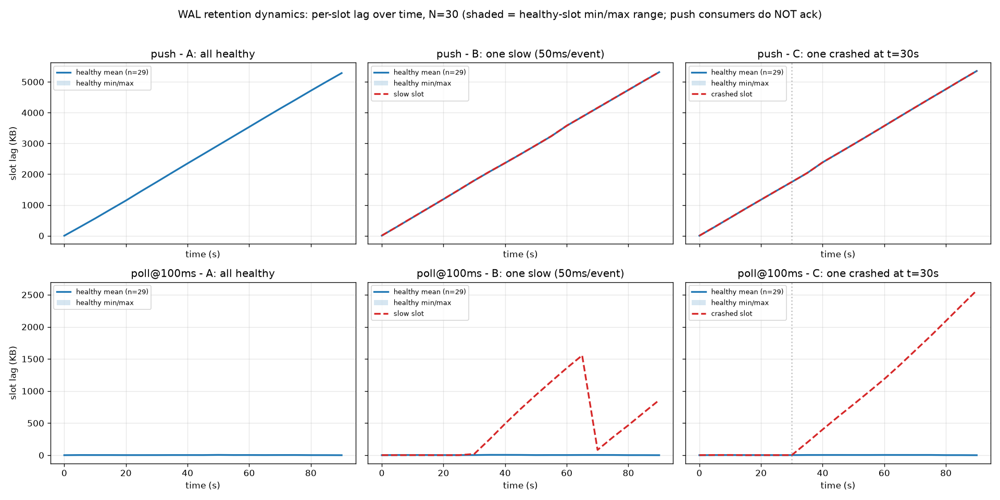

The vertical scale gap between the top row (push, in MB) and bottom row (polling, in KB) is the headline of this report: polling auto-cleans, push retains.

### Scenario A: all consumers healthy

| N | transport | healthy avg end lag |
| ---:| ---:| ---:|
| 5 | push | 5 852 KB |
| 5 | poll @ 100 ms | 41 B (≈ 0) |
| 30 | push | 5 413 KB |
| 30 | poll @ 100 ms | 160 B (≈ 0) |

Polling drains its slot on every poll cycle, so slot lag is essentially zero (a few KB at most, from one polling cycle's worth of in-flight events) regardless of consumer count. Push retains WAL until the consumer acks; without acks, every slot accumulates ~5 MB over 90 s at 500 ev/s (matches the producer's WAL emission rate).

### Scenario B: one slow consumer (50 ms per-event sleep)

| N | transport | healthy avg end lag | slow end lag | slow max lag (peak) |
| ---:| ---:| ---:| ---:| ---:|
| 5 | push | 5 618 KB | 5 618 KB | 5 618 KB |
| 5 | poll @ 100 ms | 474 B | 3 402 KB | 3 402 KB |
| 30 | push | 5 445 KB | 5 447 KB | 5 447 KB |
| 30 | poll @ 100 ms | 310 B | 880 KB | 1 593 KB |

**Two findings**:
1. **Per-slot independence**: across both transports, the slow consumer's slot does NOT drag healthy consumers' slots. Each slot has its own `confirmed_flush_lsn`. The retention asymmetry is per-slot, not global.
2. **Polling under slow consumer**: the polling slow-slot does retain MB-level WAL because the polling drain happens INSIDE the receiver task whose per-event delay throttles drain frequency. At N=30 (more headroom per host CPU thread), the slow slot recovers to under 1 MB by end-of-window; at N=5 it stays at ~3.4 MB. Polling self-heals on the slow consumer once the consumer catches up.

### Scenario C: one crashed consumer (aborted at t=30 s)

| N | transport | healthy avg end lag | crashed end lag |
| ---:| ---:| ---:| ---:|
| 5 | push | 5 648 KB | 5 649 KB |
| 5 | poll @ 100 ms | 52 B | 3 399 KB |
| 30 | push | 5 484 KB | 5 484 KB |
| 30 | poll @ 100 ms | 0 B | 2 630 KB |

**Healthy slots independent from crashed slot** in both transports. The crashed polling slot's lag grows from t=30s onward at the producer's WAL rate (~500 ev/s × ~80 bytes/event ≈ 40 KB/s; over 60 s of post-crash that's ~2.4 MB — matches the table). The crashed push slot's lag is indistinguishable from healthy push slots because none of them are acking; in production with acking healthy consumers, the gap would be visible.

**This contradicts the folklore that "one bad consumer pins WAL for everyone"** — that's only true if you have ONE slot with multiple consumers reading from it (which neither transport allows here). Per-slot WAL retention is per-slot.

## Finding 4: throughput ceiling

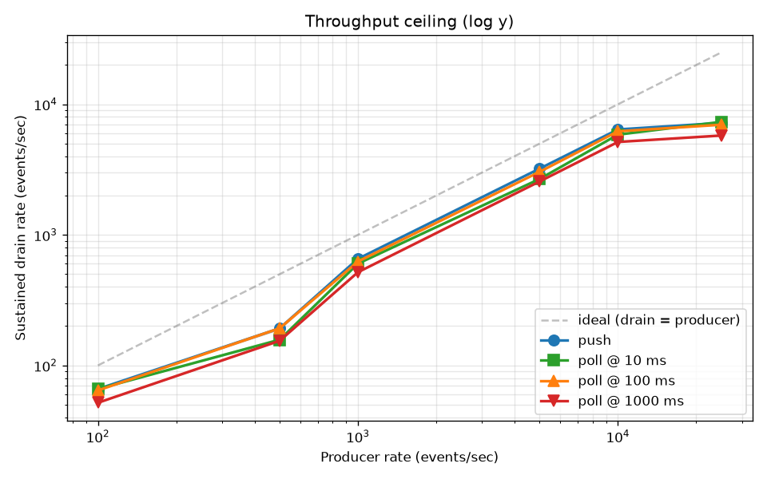

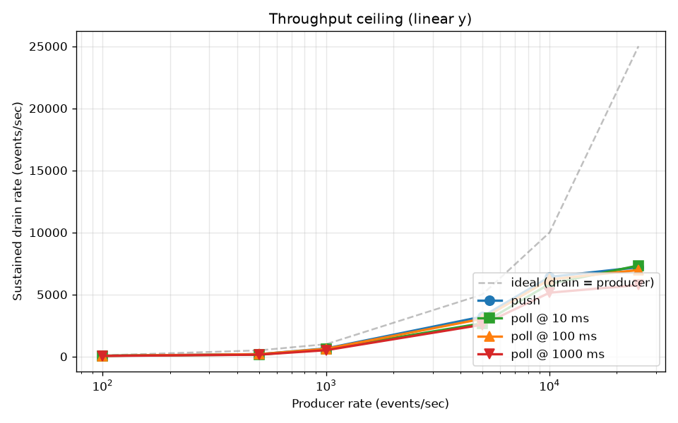

The dashed gray line is `drain = producer` (perfect keep-up). The log-y view makes the gap from ideal visible at every rate; the linear-y view makes the "all four transports plateau at ~7 000 drain/s above 5k producer rate" finding immediate.

Per-trial drain rate mean (events/sec, error bars on the plot):

| producer rate (/s) | push | poll @ 100 ms | poll @ 1000 ms |
| ---:| ---:| ---:| ---:|
| 100 | 64 | 64 | 53 |
| 500 | 175 | 180 | 159 |
| 1 000 | 661 | 633 | 540 |
| 5 000 | 3 161 | 3 041 | 2 567 |
| 10 000 | 6 419 | 6 211 | 5 147 |
| 25 000 | 7 201 | 6 975 | 5 767 |

On this idle quiet host with the dedicated producer thread:

- All transports scale roughly linearly with producer rate up to ~10 000 ev/s, then host CPU saturation flattens both transports and they converge around ~7k drain/s.
- The 25k/s "drain rate" of 7 201 includes the drain-grace window in the denominator, so it's a conservative bound — the actual peak drain during the producer window is higher.
- **Polling at 100 ms keeps up with up to ~10k events/sec on this host.** This is much higher than the ~1k/s ceiling we saw on the noisy local host — the previous ceiling was a host-contention artifact, not a transport limit.

The honest read: on a quiet single-instance PG host, the polling and push throughput ceilings are similar (both pegged at ~7k/s by host CPU). On a contended host, polling falls behind faster than push. So push's throughput-ceiling advantage is conditional on the host having headroom, but it always degrades better.

## Finding 5: decomposing the N=100 cliff

Experiment A above couples three things — N concurrent producer backends, N concurrent CDC consumers, and the resulting aggregate event rate (`N × 200 = 20 000 ev/s` at N=100). The collapse at N=100 could be from any of those three, or all of them at once. `examples/scale_isolation.rs` and `examples/scale_mesh.rs` separate the axes and produce a clean decomposition.

### Writer-side: 100 backends cap at ~16 k ev/s

`scale_isolation.rs` Experiment W runs N writer threads doing 200 ev/s single-row INSERTs each, **with NO CDC consumers attached**. The aggregate write rate vs target:

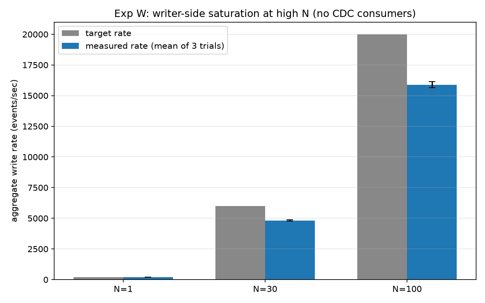

| N writers | target rate | measured rate | x of target |
| ---:| ---:| ---:| ---:|
| 1 | 200 | 197 ± 0 | 99% |
| 30 | 6 000 | 4 823 ± 54 | 80% |
| 100 | 20 000 | 15 890 ± 255 | 79% |

100 single-row-INSERT backends saturate around 16 k ev/s — the write side has real contention at high N even without any CDC consumers, but it does not collapse to multi-second latencies. Writer-side contention costs ~20% of throughput, not 3 orders of magnitude.

### CDC-side: the cliff is mostly here

`scale_isolation.rs` Experiment C uses a SINGLE batched writer at a fixed total rate, with N CDC consumers reading the same publication. This decouples CDC fanout from writer-side contention:

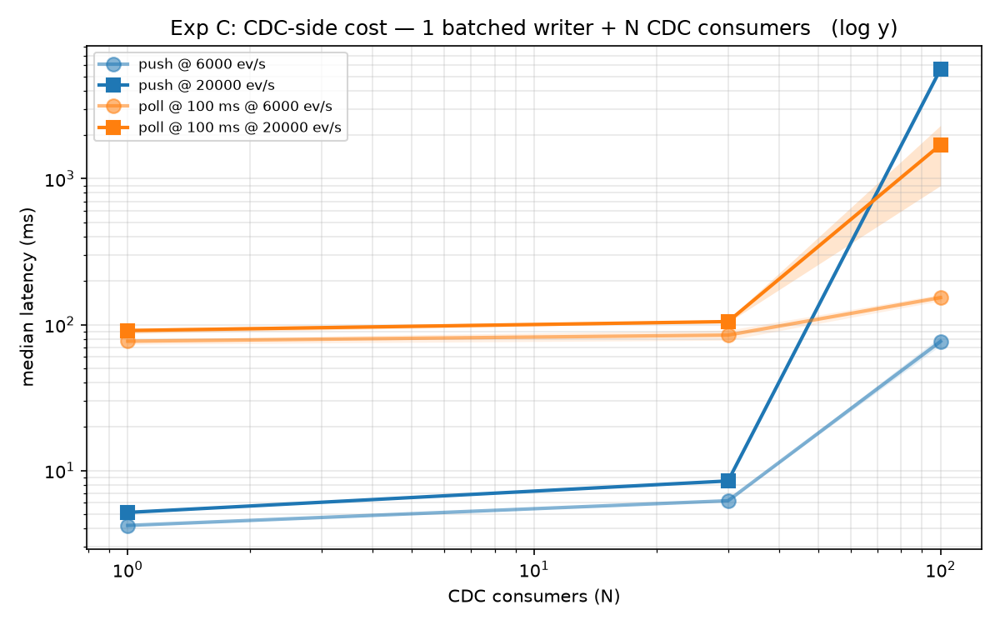

| total rate (ev/s) | N | push median | poll @ 100 ms median |
| ---:| ---:| ---:| ---:|
| 6 000 | 1 | 4.2 ± 0.0 ms | 77.0 ± 3.3 ms |
| 6 000 | 30 | 6.2 ± 0.0 ms | 84.8 ± 6.7 ms |
| 6 000 | 100 | 76.8 ± 5.8 ms | 153.2 ± 7.8 ms |
| 20 000 | 1 | 5.2 ± 0.1 ms | 91.1 ± 3.7 ms |
| 20 000 | 30 | 8.5 ± 0.1 ms | 104.9 ± 2.5 ms |
| 20 000 | 100 | **5 649 ± 60 ms** | **1 712 ± 733 ms** |

The push cliff at 100 consumers × 20 k ev/s reproduces with a single batched writer (5.6 s push median) — so the writer-side contribution to the combined Experiment A cell (7.9 s) is roughly 2.3 s, and ~5.6 s of the 7.9 s is the CDC fanout cost. The dominant component of the cliff is on the CDC side: 100 wal-senders at 20 k ev/s exceeds the host's ability to stream WAL out.

Notably, at the 20 k × 100 cell, **poll @ 100 ms beats push** (1.7 s vs 5.6 s). When push wal-senders saturate, polling's natural batching wins because each 100 ms cycle pulls a chunk in one SQL round-trip instead of streaming individual events.

### Two-dimensional view: poll fails on N alone

`scale_mesh.rs` walks (N, rate) as independent axes (N ∈ {5, 30, 100}, rate ∈ {1 k, 5 k, 10 k, 20 k} ev/s) with a single batched writer per cell:

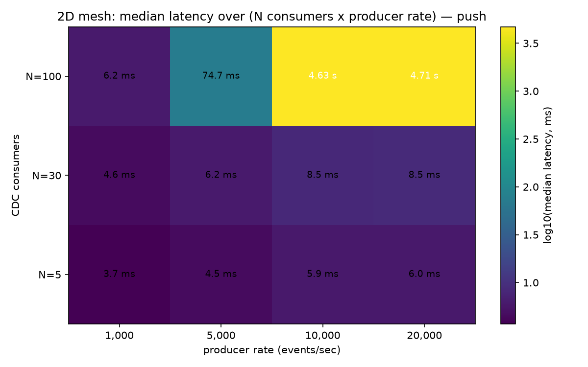

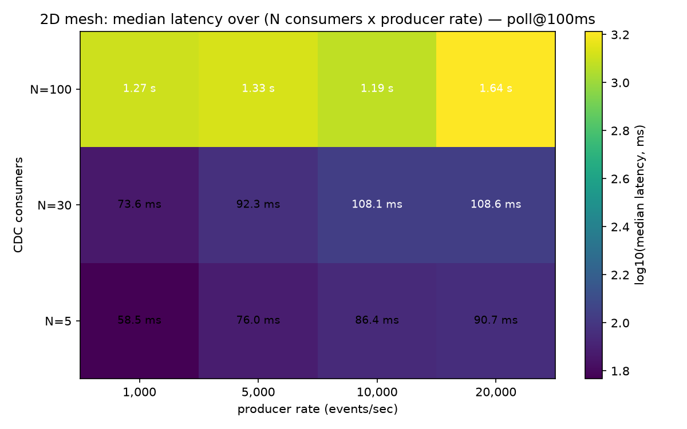

The two heatmaps tell different stories:

- **Push** stays under 10 ms across the entire `N ≤ 30` row and is fine at N=100 × 1 k ev/s (6.2 ms). The cliff is at the corner: N=100 × ≥10 k ev/s collapses to ~4.7 s. Push fails on the product of fanout AND throughput.
- **Poll @ 100 ms** fails on N alone. Every N=100 cell collapses to 1.19-1.64 s, even at the lowest rate (1 k ev/s). 100 polling clients each running `pg_logical_slot_get_binary_changes` ten times per second is enough to saturate PG's SQL backend regardless of the event rate.

The most striking individual cell: **at N=100 × 1 k ev/s, push is 6.2 ms and poll is 1 270 ms — a ~200× advantage for push.** The N=100 × low-rate region is where push's architectural advantage is widest. At N=30 push is still cheaper but the gap is only ~12-18×.

### What this means for the cliff narrative

The earlier framing — "both transports collapse together at saturation" — was true at the Experiment A combined cell, but it conflated three independent failure modes:

1. **Writer-side**: ~16 k ev/s ceiling at 100 backends. Costs throughput, not latency.
2. **Push CDC**: 100 wal-senders × ≥10 k ev/s collapse. Costs latency. Push at modest rate (1 k) is fine even at N=100.
3. **Poll CDC**: 100 polling clients collapse on N alone. Costs latency regardless of rate.

Push has a single failure mode in the corner; polling has a failure mode on the entire N=100 row. For a deployment that expects to scale to 100 consumers, push is the only transport that stays in the floor at modest rates.

## Honest exceptions

Three regimes where polling wins on per-event latency:

1. **Large-COMMIT workloads (W3.2).** A 1000-row single COMMIT delivers all 1000 events at COMMIT time. Polling drains them in one SQL round-trip; push streams them one CopyBoth frame at a time. Polling wins on per-event median (~3-4 ms vs push 7-13 ms). ETL backfills and bulk migrations are the canonical case.

2. **WAL retention under undisciplined consumers (W4.3, this report's Finding 3).** Polling auto-advances on drain. Push requires explicit `ack()`. For deployments where ack discipline cannot be guaranteed, polling has a genuine operational safety property — it cannot accumulate WAL backlog because the drain mechanism is the same operation that advances the slot.

3. **The push-saturated corner (Finding 5).** At N=100 × ≥10 k ev/s push collapses to ~4.7 s median while poll @ 100 ms collapses to ~1.5 s. When wal-sender count × event rate exceeds the host's WAL-out capacity, polling's batched drain wins. This is the narrow regime where the polling cliff is shallower than the push cliff. For N ≤ 30 at any rate in this study, push still wins decisively.

## Recommendation

For real-time event-fan-out workloads (subql's primary use case), push is the right default at every common polling cadence and at every consumer count up to ~30 on a single PG instance. Concrete reproducible savings on a quiet host:

- **At 100 ms polling**, push saves ~50-80 ms per event median, holding from 100 ev/s up to 25k ev/s producer rate.
- **At 1 s polling**, push saves ~510-560 ms per event median. This is the regime where polling breaks any "real-time" claim.
- **Push scales to N=100 consumers** at constant rate (Experiment B) while staying at the wire-RTT floor. At N=100 × 1 k ev/s push is 6.2 ms while polling is 1 270 ms (~200×).
- **Push collapses only at the corner** (N=100 × ≥10 k ev/s combined); poll @ 100 ms collapses on N=100 alone, even at 1 k ev/s, because 100 concurrent polling backends saturate PG's SQL side independent of event rate. Finding 5 decomposes these failure modes.
- **At a single PG instance the credible upper bound is N=100 × ~6 k ev/s for push** (still sub-100 ms). Above ~10 k ev/s on N=100 push, you need multi-PG-node deployments.
- **Polling generates 6-7x more committed PG transactions** than push at N=100 consumers under fixed-rate workload — server-side cost grows linearly with consumer count for polling.

For bulk ETL with large per-COMMIT batches, polling has a real I/O efficiency advantage (Finding 1, exception). For ack-undisciplined consumers (operators who can't guarantee `ack()` calls), polling's auto-cleanup is a genuine safety property.

If you're building real-time CDC fan-out, default to push. If you're building bulk ETL or operating in a regime where ack-discipline can't be guaranteed, polling is a defensible alternative — and the same library expresses it (`subql::PollingPgCdcSource` implements the same `CdcSource` trait, so application code is portable between transports).

## What this report does NOT cover

- Multi-PG-node setups (cross-host, multi-AZ). Single Docker host only.
- Cross-host network latency variation.
- pgoutput `proto_version >= 2` features (partitioned tables, streaming-in-progress transactions, two-phase commit).
- Connection-flap resilience (W4.4 stub; needs `NET_ADMIN`-capable container).
- Comparison against Debezium / Maxwell / Supabase ETL. Stays subql-only.
- Behavior under sustained N > 100 consumers (PG's `max_wal_senders` and host CPU constrain single-instance scaling).
- Behavior with disciplined `ack()` callers on push (the benchmark deliberately exposes the worst case).

A future revision should fill in these dimensions if there's appetite for a multi-host benchmark.

## Reproducibility

Run each benchmark with:

```sh
cargo run --release --example scale_throughput --features pg-streaming
cargo run --release --example scale_consumers --features pg-streaming
cargo run --release --example scale_retention --features pg-streaming
cargo run --release --example scale_isolation --features pg-streaming
cargo run --release --example scale_mesh --features pg-streaming
```

Run them **sequentially, not in parallel** — host contention from concurrent runs visibly degrades the lower-rate / lower-N cells.

On a quiet host (load < 1) the wall-clocks are roughly 20 min each (throughput, retention), 35 min (consumers, 3 trials × 20 cells), 27 min (isolation, 21 cells), and 30 min (mesh, 24 cells), so the full suite is ~2.5 h.

To regenerate the plots embedded above:

```sh
./docs/benchmarks/plot.py
```

The script is a self-contained PEP 723 file (`uv` shebang) — no project setup needed. It reads all five TSVs and writes PNGs to `docs/benchmarks/plots/`. Each line plot shows the across-trial mean as a solid line and the across-trial min/max range as a shaded band; the mesh heatmaps annotate each cell with the across-trial mean.

The TSV files at `docs/benchmarks/scale-*-2026-06-15.tsv` are long-form `(experiment, scale_key, cell_key, metric, value)` rows. Per-trial values are emitted with metric keys `trial0_median_ms`, `trial1_median_ms`, etc., so external tools can recompute mean/std/quantiles without re-running the benchmark.
